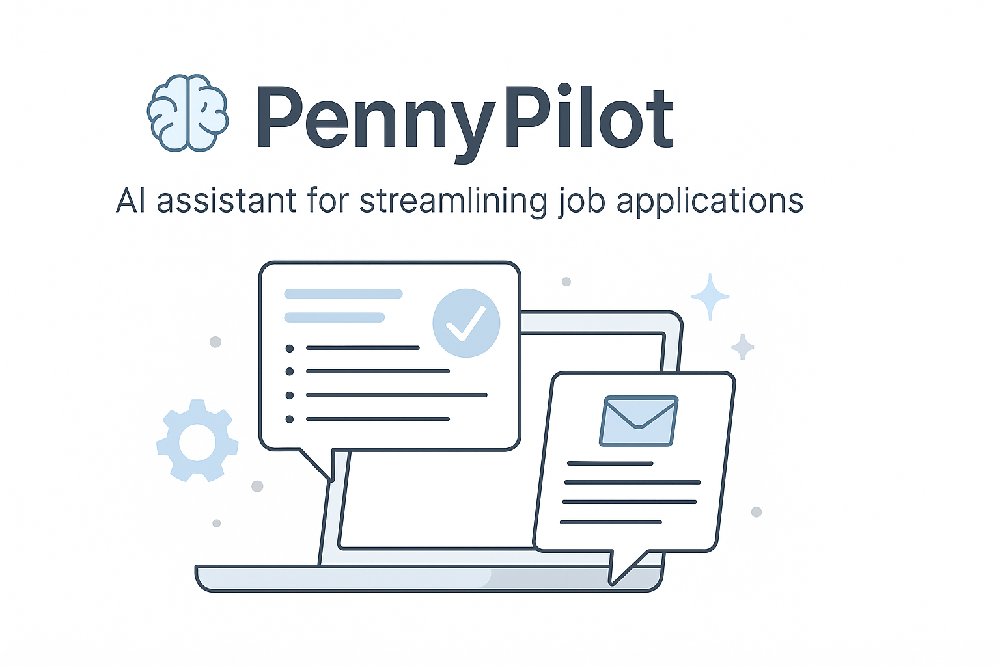

# PennyPilot — AI-Powered Job Application Assistant

PennyPilot helps you turn a job description + your CV into a tailored proposal/cover letter.  
Built with Streamlit for a clean UI and designed to run locally or in Docker.

## ✨ Current Features (Day 3)
- **Two-tab UI:** Manual Input / Upload Files
- **Upload & extract text** from **PDF, DOCX, TXT**
- **Safe parsing** with clear success/error feedback
- **Session state** keeps your text when switching tabs

> Next up: Generate Proposal button + integration with `proposal_writer.py`, copy-to-clipboard, and optional LLM support.

## 🧰 Tech
- Python, Streamlit
- `pdfplumber` for PDFs
- `python-docx` for DOCX

## 🚀 Quickstart

### 1) Clone
```bash
git clone https://github.com/Serhii-Mazurenko376/pennypilot-ai
cd pennypilot-ai
```
### 2) Install deps
```
python -m venv .venv
source .venv/bin/activate   # Windows: .venv\Scripts\activate
pip install -r requirements.txt
```
### 3) Run
```
streamlit run app.py
```
Open the URL Streamlit prints (usually http://localhost:8501).
## 🖥️ How to Use

    Manual Input tab: paste job description and your CV text.

    Upload Files tab: upload .pdf / .docx / .txt, choose if it’s Job Description or CV, preview, then click Use as ….

    Check the counters at the bottom to confirm both fields are populated.

    (Coming soon) Click Generate Proposal to get a tailored draft.

## 📦 Project Structure
```
pennypilot-ai/
├─ app.py                      # Streamlit UI
├─ tools/
│  └─ file_extract.py          # File parsing helpers (PDF/DOCX/TXT)
├─ requirements.txt
└─ README.md
```
## 🧪 Testing (planned)

    pytest coverage for tools/file_extract.py

    Fixtures for sample PDFs/DOCX/TXT

## 🐳 Docker (optional, planned)

    Production-ready Dockerfile

    Run with: docker build -t pennypilot . && docker run -p 8501:8501 pennypilot

## 🗺️ Roadmap

    Generate proposal button wired to proposal_writer.py

    Copy-to-Clipboard

    Basic job scraping tool (paste a URL → fetch & parse)

    Optional LLM-powered personalization (OpenAI/Ollama/Mixtral via LangChain)

    Unit tests + CI

    One-click deploy (Render/Railway/HF Spaces)

## 🤝 Contributing

PRs and suggestions welcome. Open an issue for ideas or bugs.
## 📄 License

MIT
---

## 📸 Banner

